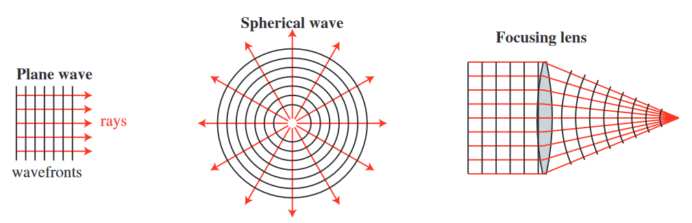

# Geometrical Optics

## Background

Start with an arbitrary field given by

\begin{equation}
    \vec{E}(r) = \vec{E}_0 (r) \exp [-j k_0 \phi(r)]
\end{equation}

and 

\begin{equation}
    \vec{H}(r) = \vec{H}_0 (r) \exp [-j k_0 \phi(r)]
\end{equation}

The term $k_0 \phi$ defines the planes of constant phase (the wavefront).

Apply Maxwell’s equation

\begin{equation}
    \nabla \times \vec{E} = -j \omega \mu \vec{H}
\end{equation}

The electric field has both a vector and a scalar component

\begin{equation}
    \vec{E}(r) = \vec{E}_0 \exp [-j k_0 \phi(r)]
\end{equation}

Use the vector identity

\begin{equation}
    \nabla \times (f \vec{A}) = f (\nabla \times \vec{A}) + (\nabla f) \times \vec{A}
\end{equation}

to get

```{math}
:label: after_identity
    \nabla \times \vec{E} = \exp [-j k_0 \phi(r)] (\nabla \times \vec{E}_0) + \nabla \{ \exp [-j k_0 \phi(r)] \} \times \vec{E}_0
```

The gradient of the exponential term becomes

\begin{align}
    \nabla \{ \exp [-j k_0 \phi(r)] \} &= \hat{x} (-j k_0) \exp (-j k_o \phi) \frac{\partial \phi}{\partial x} \\
    &+ \hat{y} (-j k_0) \exp (-j k_o \phi) \frac{\partial \phi}{\partial y} \\
    &+ \hat{z} (-j k_0) \exp (-j k_o \phi) \frac{\partial \phi}{\partial z} \\
    &= -j k_0 \exp (-j k_0 \phi) \nabla \phi
\end{align}

Equation {eq}`after_identity` becomes

\begin{equation}
    \nabla \times \vec{E} = \exp [-j k_0 \phi(r)] (\nabla \times \vec{E}_0) + (-j k_0) \exp (-j k_0 \phi) \nabla \phi \times \vec{E}_0
\end{equation}

This equation is also equal to $-j \omega \mu \vec{H}_0 \exp (-j k_0 \phi)$
resulting in

\begin{equation}
    -j \omega \mu \vec{H}_0 \exp (-j k_0 \phi) = \exp (-j k_0 \phi) (\nabla \times \vec{E}_0) + (-j k_0) \exp (-j k_0 \phi) \nabla \phi \times \vec{E}_0
\end{equation}

Eliminate the common exponential terms to yield

\begin{equation}
    -j \omega \mu \vec{H}_0 = (\nabla \times \vec{E}_0) + (-j k_0) \nabla \phi \times \vec{E}_0
\end{equation}

which can be rearranged to yield

\begin{align}
    \nabla \phi \times \vec{E}_0 - \frac{\nabla \times \vec{E}_0}{j k_0} - \frac{-j \omega \mu}{j \omega \sqrt{\mu \varepsilon}} \vec{H}_0 &= 0 \\
    \nabla \phi \times \vec{E}_0 + \frac{j}{k_0} \nabla \times \vec{E}_0 - \eta \vec{H}_0 &= 0 \\
\end{align}

Follow a similar process the following equations can also be derived

\begin{align}
    \nabla \phi \times \vec{H}_0 - \frac{j}{k_0} \nabla \times \vec{E}_0 - \frac{n^2}{\eta} \vec{H}_0 &= 0 \\
    \nabla \phi \cdot \vec{H}_0 + \frac{j}{k_0} \nabla \cdot \vec{H}_0 &= 0 \\
    \nabla \phi \cdot \vec{E}_0 + \frac{j}{k_0 n^2} \nabla \cdot (n^2 \vec{E}_0) &= 0
\end{align}

In the geometrical optics approximation, $\lambda \to 0$ and $k_0 \to \infty$ results in

\begin{equation}
    \nabla \phi \times \vec{E}_0 = n \eta_0 \vec{H}_0
\end{equation}

\begin{equation}
    \nabla \phi \times \vec{H}_0 = - \frac{n^2}{\eta} \vec{E}_0
\end{equation}

\begin{equation}
    \nabla \phi \cdot \vec{H}_0 = 0
\end{equation}

\begin{equation}
    \nabla \phi \cdot \vec{E}_0 = 0
\end{equation}

This means that $E_0$ and $H_0$ are both perpendicular to $\nabla \phi$.
Therefore, $\nabla \phi$ defines the ray direction, which is also the power
flow direction.



Are the rays essentially narrow beams of light (like laser beams)?

No!

Very narraow beams of light have very rapid divergence because of diffraction.

Rays are simply used to characterize the propagation of a wavefront.

Even though rays are not actually narrow beams of light, the can still be used
to analyze irradiance by looking at ray density.

```{admonition} Example

A line source has a power of $P = 1 W/m$. A linear detector with a width of 
$D = 1 mm$ is placed $R = 1 m$ away from the line source. How much power is 
received by the detector?

**Solution**

If you trace N equally spaced rays out of the line source the angular 
separation between the rays is

\begin{equation}
    \Delta \theta = \frac{2 \pi}{N}
\end{equation}

The angle to the detector is

$$
    \theta = \pm \mathrm{tan} ^{-1} \left( \frac{0.510^{-3}}{1} = 0.510^{-3} \right)
$$

For $N = 10^5$ this becomes

$$
    10^{-3} \left( \frac{10^5}{2 \pi} \right) = 16 \mathrm{rays}
$$

The received power is then

$$
    P = (16) \left( \frac{1}{10^5} \right) = 160 \mu W
$$

The actual power is

$$
    P = (1 W) \frac{10^{-3}}{2 \pi} = 159.2 \mu W
$$

The concept of calculating irradiance using ray tracing enables irradiance calcualtion for arbitrary
shapes and optical systems.

```

## Basic Postulates of Geometrical Optics

1. Rays are normal to the wavefront and vice versa.  
2. Rays satisfy the laws of reflecton and refraction.  
3. Th optical path length along any ray between two wavefronts are equal.  
4. Irradiance at any point is proportional to the ray density at that point.  

Other resulting corollaries are:

1. In a uniform medium, light travels along striaght lines.  
2. The optical paths are reversible.  
3. The optical path difference between two neighboring rays is zero.  

Ray tracing can be used to:

1. **Analyze optical systems**  
   Optimize lenses  
   Determine focal length  
   Deterine magnification  
   Determine image quality  
   etc.  
2. **Illumination analysis/design**  
   Head light reflectors  
   Light pipes  
   etc.  
3. **Image artifacts**  
   Multiple reflections off of lens surfaces  
   Scatter light off of surfaces  
