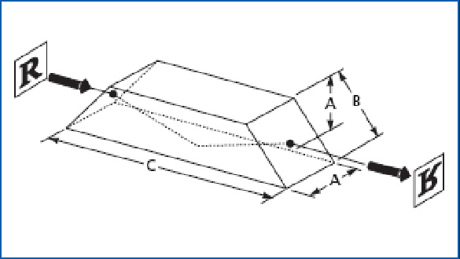
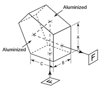
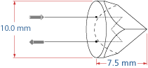
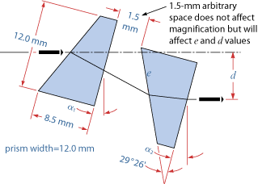
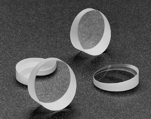

# Prisms

You can {download}`download the pdf for this page <../../files/prism.pdf>`.
## Ray optics

Here's a taste of what ray optics is.

```{figure} ../../images/part1/lensdesign.jpg
---
name: lensdesign-fig
---
```

```{figure} ../../images/part1/illumination.jpg
---
name: illumination-fig
---
```

```{figure} ../../images/part1/illumination2.jpg
---
name: illumination2-fig
---
```

```{figure} ../../images/part1/artifact.jpg
---
name: artifact-fig
---
Lens flare artifact.
```

```{figure} ../../images/part1/lens_flare.png
---
name: lensflare-fig
---
Lens flare diagram.
```

## Prisms

```{table} Selected prism types
:name: prism-table

| Prism Type | Diagram |
|---|---|
| Dove |  |
| Penta |  |
| Retro |  |
| Anamorph |  |
| Wedge |  |
```

### Uses of prisms

#### Dispersion

```{figure} ../../images/part1/dispersion.png
---
name: dispersion-fig
---
Dispersion.
```

$$
    \theta = (n - 1) \phi
$$

This is desperive because the refractive index is a function of wavelength,
i.e. $n(\lambda)$.

#### Beam bending

```{figure} ../../images/part1/beambending.png
---
name: beambending-fig
---
Beam bending.
```

This is better than a mirror because total internal reflection (TIR) is 
wavelength independent.

#### Retro-reflection

```{figure} ../../images/part1/retroreflection.png
---
name: retroreflection-fig
---
Retro reflection 
```

#### Image rotation

```{figure} ../../images/part1/rotation.png
---
name: rotation-fig
---
Image rotation using prisms.
```

```{figure} ../../images/part1/pentaprism.png
---
name: pentaprism-fig
---
A penta prism.
```

```{figure} ../../images/part1/doveprism.png
---
name: doveprism-fig
---
A dove prism.
```

#### Beam scanning

```{figure} ../../images/part1/beamscanning.png
---
name: beamscanning-fig
---
Beam scanning traces out a circle (top). 2 rotating prisms (Risley prisms),
full cone coverage (bottom).
```
